 

# Hi, I'm Musa Shah! 👋

🎓 BS Computer Science Student 
💡 Aspiring Data Analyst  
🔭 Currently learning Python & MySQL

---

## 🛠️ Languages & Tools

---

## 📂 Featured Projects

  
 
  

---

### 📈 Activity Graph

---

## 📊 GitHub Stats

---

---

## 🌐 Global Visitors

🌎 

---

## 👁️ Profile Views

👁️ 

---

## 🌐 Connect With Me

  

---

### 🐍 Contribution Snake

<picture>
  <source media="(prefers-color-scheme: dark)" srcset="https://raw.githubusercontent.com/MusashahGH/MusashahGH/output/github-contribution-grid-snake-dark.svg">
  <source media="(prefers-color-scheme: light)" srcset="https://raw.githubusercontent.com/MusashahGH/MusashahGH/output/github-contribution-grid-snake.svg">
  
</picture>

---

